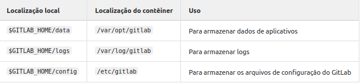
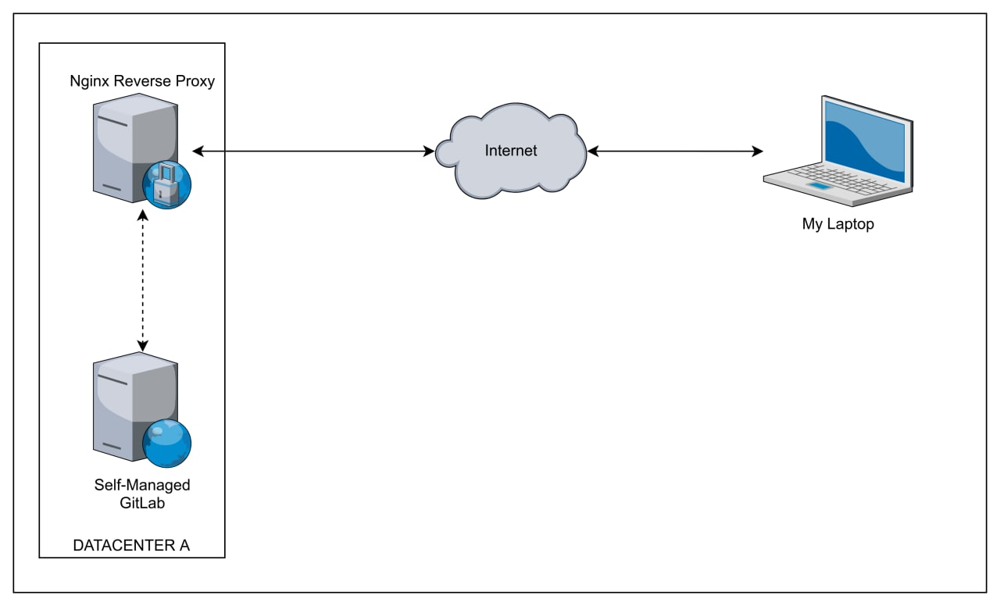

# Configuração de volumes
Como iremos provisionar o GitLab em um container, devemos configurar uma variável de ambiente que apontará o caminho dos volumes no host local para a persistência dos dados. Execute o comando:
```bash
~$ export GITLAB_HOME=/srv/gitlab
```

> :bulb: **Tip:** Para que você não precise configurar a variável toda vez que abrir o terminal, execute o seguinte comando:
```bash
~$ echo "export GITLAB_HOME='/srv/gitlab'" >> .bashrc
```

E para aplicar a configuração feita anteriormente, execute o seguinte comando:
```bash
~$ source .bashrc
```


# Instalação do GitLab-CE usando Docker Engine
Feitas as configurações das variáveis de ambiente e dos volumes, podemos iniciar a instalação.
```bash
~$ sudo docker run --detach \
  --hostname localhost \
  --env GITLAB_OMNIBUS_CONFIG="external_url 'http://gitlab-ce.local/'; gitlab_rails['lfs_enabled'] = true;" \
  --env GITLAB_ROOT_EMAIL="user-email@email.com" \
  --env GITLAB_ROOT_PASSWORD="@admin1322" \
  --publish 443:443 --publish 8080:80 --publish 22:22 \
  --name gitlab \
  --restart always \
  --volume $GITLAB_HOME/config:/etc/gitlab \
  --volume $GITLAB_HOME/logs:/var/log/gitlab \
  --volume $GITLAB_HOME/data:/var/opt/gitlab \
  --shm-size 256m \
  gitlab/gitlab-ce:latest
```
> Caso tenha ocorrido algum erro na instalação do banco de dados, não será possível utilizar a senha padrão passada no bash,
>
> verifique se é possível fazer o login! Caso contrário, para recuperar a senha execute o comando bash a seguir:

```bash
sudo docker exec -it gitlab grep 'Password:' /etc/gitlab/initial_root_password
```
# Instalação do GitLab-CE usando o Docker Compose
```bash
docker compose up -d 
```
É possível acompanhar a execução do container, execute o comando bash a seguir:
```bash
sudo docker logs -f gitlab
```
# Rodando o projeto localhost com I.P público via NGROK
> Observação: Primeiro é preciso criar uma conta no ngrok.com, logo em seguida crie seu access_token
Agora é preciso instalar o ngrok em sua instância local, execute o comando bash a seguir:

```bash
curl -sSL https://ngrok-agent.s3.amazonaws.com/ngrok.asc \
  | sudo tee /etc/apt/trusted.gpg.d/ngrok.asc >/dev/null \
  && echo "deb https://ngrok-agent.s3.amazonaws.com buster main" \
  | sudo tee /etc/apt/sources.list.d/ngrok.list \
  && sudo apt update \
  && sudo apt install ngrok
```
Agora você precisa configurar seu token para criar o túnel:
```bash
ngrok config add-authtoken <token>
```
Para finalizar, você precisa iniciar o ngrok
```bash
ngrok http gitlab-ce.local
```
> Observação: Para fins didáticos da utilização do **NPM - nginx proxy manager** o apontamento do **ngrok**
>
> deve ser para o nome do container npm, e o container irá resolver o acesso com o proxy reverso.
```bash
ngrok http npm
```
# Usando a interface do Nginx Proxy Manager - NPM

> Navegue até a pasta do projeto NPM, logo em seguida execute o comando bash a seguir:
```bash
sudo docker compose up -d
```
Faça login na interface do usuário do administrador

http://127.0.0.1:81

Quando o contêiner do docker estiver em execução, conecte-se a ele na porta da interface de administração acima, em alguns
casos pode ocorrer uma demora para acessar a interface de administração devido a entropia das chaves.

Após carregada a interface de usuário, utilize os dados de acesso padrão a seguir:
```
Email:    admin@example.com
Password: changeme
```
Efetuado o primeiro acesso, a interface de administração irá solicitar que seja atualizado o endereço de e-mail e senha.

> NOTA: Caso você esteja utilizando as 3 estruturas deste projeto, lembre-se sempre de se lembrar de nunca
>
> se esquecer de criar a rede local, para que seja possível a comunicação entre as aplicações, para isto basta
>
> executar o comando bash a seguir antes de subir os containers:

```bash
docker network create nginx-gitlab
```